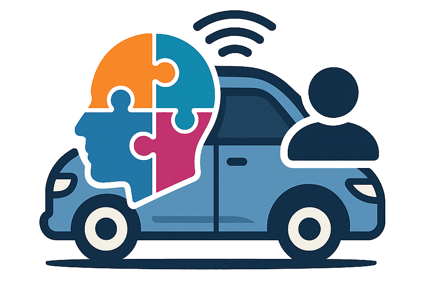
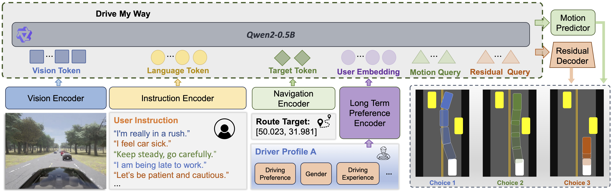
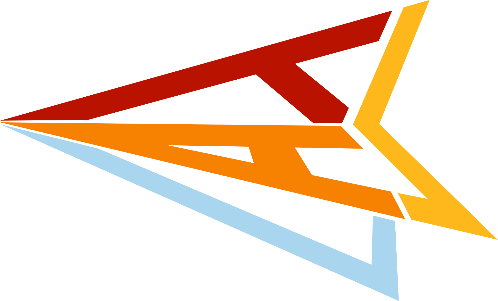

#  Drive My Way (DMW)

**Preference Alignment of Vision-Language-Action Model for Personalized Driving**


[](https://cvpr.thecvf.com/)
[](https://dmw-cvpr.github.io/)

[](https://tasl.ucr.edu/)


[Zehao Wang](https://zehaowang983.github.io/)<sup>1</sup>, [Huaide Jiang](https://openreview.net/profile?id=%7EHuaide_Jiang1)<sup>1</sup>, [Shuaiwu Dong](https://www.linkedin.com/in/shuaiwu-dong-5523542a1/)<sup>1</sup>, [Yuping Wang](https://www.linkedin.com/in/yuping-wang-5a7178185/)<sup>1,2</sup>, [Hang Qiu](https://hangqiu.github.io/)<sup>1</sup>, [Jiachen Li](https://jiachenli94.github.io/)<sup>1\*</sup>

<sup>1</sup>University of California, Riverside &nbsp; <sup>2</sup>University of Michigan &nbsp; <sup>\*</sup>Corresponding author

---

## Abstract

Human driving behavior is inherently personal, shaped by long-term habits and influenced by short-term intentions. Individuals differ in how they accelerate, brake, merge, yield, and overtake across diverse situations. However, existing end-to-end autonomous driving systems either optimize for generic objectives or rely on fixed driving modes, lacking the ability to adapt to individual preferences or interpret natural language intent.

To address this gap, we propose **Drive My Way (DMW)**, a personalized Vision-Language-Action (VLA) driving framework that aligns with users' long-term driving habits and adapts to real-time user instructions. DMW learns a user embedding from our personalized driving dataset collected across multiple real drivers and conditions the policy on this embedding during planning, while natural language instructions provide additional short-term guidance. Closed-loop evaluation on the Bench2Drive benchmark demonstrates that DMW improves style instruction adaptation, and user studies show that its generated behaviors are recognizable as each driver's own style, highlighting personalization as a key capability for human-centered autonomous driving.

---

## Key Features

- **Long-term preference learning** — A contrastive preference encoder learns user embeddings from structured driver profiles and historical driving behavior, capturing stable individual driving habits.
- **Short-term instruction alignment** — Natural language instructions at runtime steer the policy toward the user's immediate intent (e.g., aggressive vs. conservative maneuvers).
- **GRPO-based policy alignment** — Group Relative Policy Optimization with style-aware rewards aligns the VLA policy to diverse user preferences without relying on explicit human feedback.
- **Personalized Driving Dataset (PDD)** — Real human driving demonstrations across diverse CARLA scenarios, collected with a steering wheel setup across multiple drivers and conditions.

---

## Method Overview

<p align="center">
  
</p>

Given camera observations and navigation goals, DMW fuses the driver's long-term preferences (via a learned user embedding) with real-time natural language instructions to produce adaptive, personalized actions.

---

## Personalized Driving Dataset (PDD)

PDD collects real human driving demonstrations across diverse scenarios in CARLA using a steering wheel setup. It covers a wide range of interactive scenarios: cut-ins, pedestrians, obstacle avoidance, merging, and more.

**Download:** PDD is coming soon.

Sample drivers from the dataset, recorded at 2× speed:


---

## Prerequisites

- Linux (Ubuntu 20.04+ recommended)
- Conda / Miniconda
- CUDA 12.1 (for PyTorch 2.2.0 + flash-attn)
- CARLA 0.9.15 simulator

---

## Installation

### 1. Create the Conda Environment

```bash
conda env create -f environment.yaml
conda activate dmw
```

This installs Python 3.8 and base system packages. All Python dependencies are installed via pip inside the conda env.

### 2. Install Remaining pip Dependencies

```bash
pip install -r requirements.txt
```

#### Install flash-attention (optional but recommended for speed)

```bash
pip install flash-attn==2.7.0.post2 --no-build-isolation
```

### 3. Install the Custom TRL Library (GRPO)

This repo contains a stripped-down TRL fork with only GRPO training support.

```bash
cd grpo
pip install -e .
cd ..
```

The custom TRL requires:
```
accelerate >= 1.4.0
datasets >= 3.0.0
transformers >= 4.55.0
```

These are already covered by `requirements.txt`.

### 4. Set Up CARLA

#### Download CARLA 0.9.15

Download and extract CARLA 0.9.15 to your system (e.g., `/home/<user>/carla0915`).

Official download: https://github.com/carla-simulator/carla/releases/tag/0.9.15

#### Configure Environment Variables

Edit `setup_carla.sh` to match your paths, then source it:

```bash
# Edit these paths in setup_carla.sh
export CARLA_ROOT=/home/<user>/carla0915
export WORK_DIR=/home/<user>/Downloads/DMW

# Then source it
source setup_carla.sh
```

This sets the following `PYTHONPATH` entries:
- `$CARLA_ROOT/PythonAPI/carla`
- `$WORK_DIR/scenario_runner_autopilot`
- `$WORK_DIR/leaderboard_autopilot`
- `$WORK_DIR/trl`

Add `source /path/to/setup_carla.sh` to your `.bashrc` / `.zshrc` to persist across sessions.

### 5. Download Pretrained Model

The training pipeline uses **InternVL2-1B** as the base vision-language model.

```bash
# Expected path: pretrained/InternVL2-1B/
huggingface-cli download OpenGVLab/InternVL2-1B --local-dir pretrained/InternVL2-1B
```

### 6. Verify Installation

```bash
conda activate dmw
python -c "import trl; from trl import GRPOTrainer, GRPOConfig; print('TRL OK')"
python -c "import torch; print('PyTorch:', torch.__version__); print('CUDA:', torch.cuda.is_available())"
python -c "import transformers; print('Transformers:', transformers.__version__)"
```

---

## Directory Structure

```
DMW/
├── grpo/                       # GRPO post-training (to be released)
├── model/                      # Model definitions
├── team_code/                  # CARLA agent
├── leaderboard/                # CARLA leaderboard evaluation
├── scenario_runner/            # CARLA scenario runner
├── pretrained/                 # Base VLM checkpoint (InternVL2-1B)
├── data/                       # Training / validation route configs and PDD splits
├── environment.yaml            # Conda environment spec
├── requirements.txt            # pip dependencies
└── setup_carla.sh              # Environment variable setup
```

---

## Key Version Summary

| Package        | Version       |
|----------------|---------------|
| Python         | 3.8.18        |
| PyTorch        | 2.2.0         |
| CUDA           | 12.1          |
| Transformers   | >= 4.55.0     |
| Accelerate     | >= 1.4.0      |
| DeepSpeed      | 0.16.2        |
| PEFT           | 0.13.2        |
| flash-attn     | 2.7.0.post2   |
| CARLA          | 0.9.15        |

---

## Common Issues

**`carla` module not found**
- Ensure `setup_carla.sh` is sourced and `$CARLA_ROOT/PythonAPI/carla` is on `PYTHONPATH`.

**`flash_attn` build fails**
- Match your CUDA version exactly. Use `nvcc --version` and `python -c "import torch; print(torch.version.cuda)"` to confirm alignment.

**`transformers` version conflict**
- TRL requires `>= 4.55.0` while `environment.yaml` pins `4.46.3`. After `conda env create`, upgrade via:
  ```bash
  pip install "transformers>=4.55.0"
  ```

**DeepSpeed compilation errors**
- Ensure `ninja` is installed: `pip install ninja`
- Set `DS_BUILD_OPS=0` to disable custom CUDA kernel compilation during import.

---

## Citation

If you find this work useful, please cite:

```bibtex

```

<p align="center">
  <a href="https://tasl.ucr.edu/">
    
  </a>
  &nbsp;&nbsp;
  <a href="https://tasl.ucr.edu/publications/">More Works from TASL</a>
</p>
